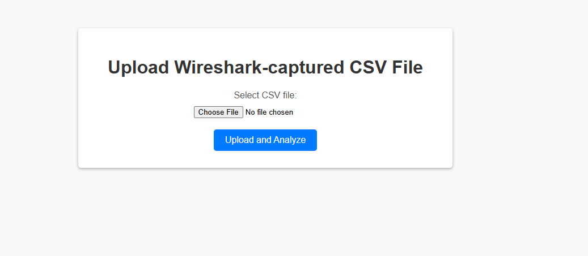
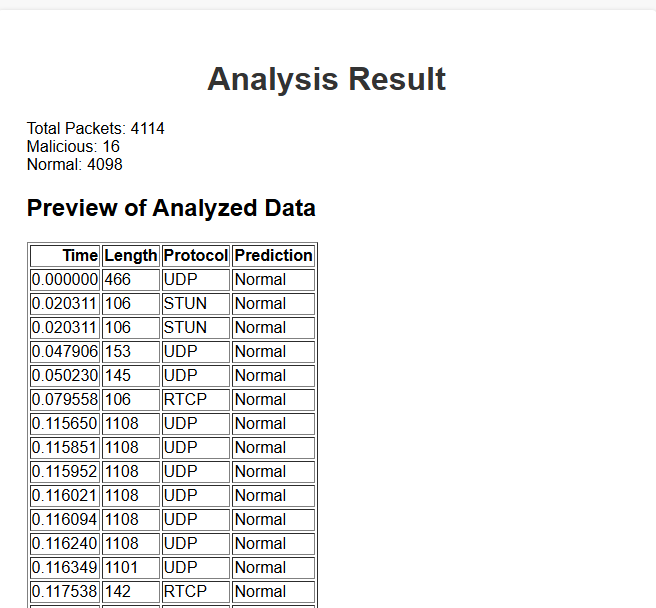
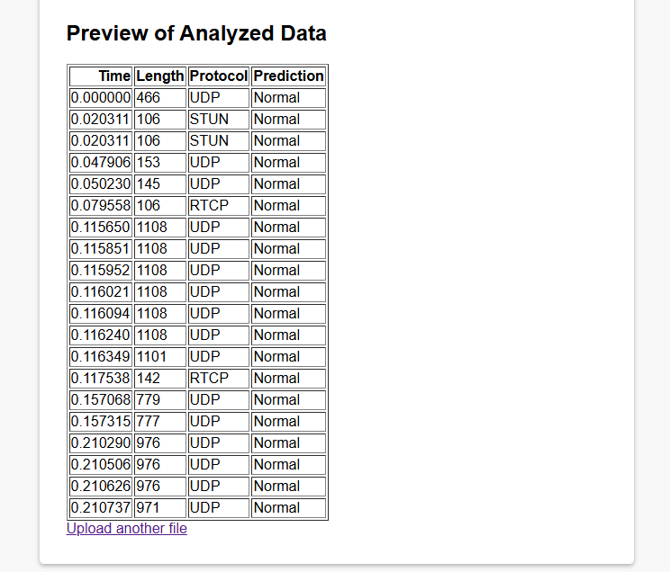

# Real-Time-Network-Intrusion-Detection-System 

A machine learning-based project to detect and analyze suspicious network activity using Python.  

## Features  
- **Dataset**: Pre-processed `NetworkIntrusionDataset.csv` for training.  
- **Web Interface**: Flask-based dashboard (see `app.py` and `templates/`).  
- **Static Files**: CSS/JS in `static/` for frontend styling.  
- **Jupyter Notebook**: `trainedML.ipynb` (renamed from `trainedMLipynb`) for model training.  

## Installation  
1. Clone the repository:  
   ```bash
   git clone https://github.com/HamzaAnees786/Real-Time-Network-Intrusion-Detection-System.git

2. Install dependencies:
   pip install flask pandas scikit-learn numpy matplotlib
3. Run the application:
   python app.py

Usage
Training Model:

Open trainedML.ipynb in Jupyter Notebook to retrain the ML model

## Screenshot
*Real-time intrusion detection interface.*  

*Result*

  
